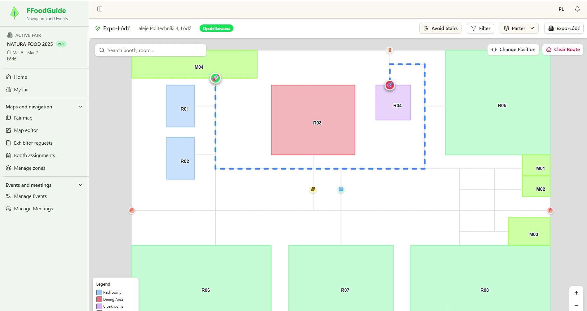

# FFoodGuide

**[🇵🇱 Polski](#-wersja-polska) | [🇬🇧 English](#-english-version)**

---

## 🇵🇱 Wersja Polska

### 📋 Opis Projektu

FFoodGuide to system stworzony z myślą o **organizacji targów branżowych**. Dostarcza narzędzia do tworzenia interaktywnych map hal i budynków, planowania rozmieszczenia stoisk, nawigacji wewnątrz obiektów oraz zarządzania wydarzeniami i spotkaniami biznesowymi. System zrealizowano w architekturze trójwarstwowej: warstwa danych (**PostgreSQL**), warstwa serwerowa (**Java + Spring Boot**) oraz aplikacja kliencka typu SPA zbudowana w **React**. Poszczególne elementy współpracują ze sobą, by zapewnić organizatorom i uczestnikom sprawne i wygodne doświadczenie podczas wydarzeń.

### 🏗️ Moduły Projektu

#### 1. 📍 Moduł Planowania Przestrzeni i Nawigacji
- Wspomaganie planowania przestrzeni fizycznej
- Nawigacja uczestników na terenie wydarzenia
- **Autor:** Wiktoria Bilecka

#### 2. 📅 Moduł Organizacji Wydarzeń i Spotkań Biznesowych
- Zarządzanie wydarzeniami i spotkaniami
- Organizacja aspektów biznesowych
- **Autor:** Grzegorz Janasek

---

### 🔧 Moduł: Planowanie przestrzeni i nawigacja — krótko i na temat

Moduł ten dostarcza narzędzia zarówno dla organizatorów (projektowanie, generowanie i przypisywanie stoisk), jak i dla uczestników (interaktywne mapy i wygodna nawigacja).

#### 🗺️ Interaktywna mapa
- Organizator tworzy mapy wnętrz (wiele budynków i pięter możliwe).
- Użytkownik widzi pojedyncze piętro na raz — przełączanie między piętrami i budynkami intuicyjne.
- Klikalne obiekty (stoiska, sale) pokazują szczegóły: numer, opis, wystawcę itp.
- Filtry (np. kategorie tematyczne) ułatwiają wyszukiwanie interesujących miejsc.

#### 🧭 Nawigacja wewnętrzna
- Użytkownik określa punkt startu i cel (może też wyszukać cel — system ustawi go automatycznie).
- Trasa jest segmentowana (wielopiętrowe/budynkowe przejścia tworzą oddzielne segmenty).
- Trasa animowana; punkty przejścia są interaktywne — kliknij, żeby przejść do następnego etapu trasy.
- Tryb „unikać schodów" (dla osób z ograniczoną mobilnością): preferowane windy i rampy ♿️.
- Wyznaczanie trasy realizowane jest autorskim algorytmem najkrótszej ścieżki w ważonym grafie z heterogenicznymi kosztami — realne trasy uwzględniają typ przejść i preferencje użytkownika.

#### 🖌️ Edytor map (dla organizatora)
- Interaktywny edytor 2D (rzut z góry): dodawanie budynków, pięter, sal i stoisk — rysowane bezpośrednio na mapie.
- Tworzenie węzłów i połączeń, które składają się na graf przejść wykorzystywany w nawigacji.
- Automatyczne generowanie układu stoisk: podaje się liczbę stoisk, ich wymiary i parametry korytarzy — system zaproponuje układ.
- Generowanie działa w dwóch krokach:
  1. Optymalizacja układu rzędów i korytarzy (minimalizacja niewykorzystanych miejsc, symetryczne konfiguracje).
  2. Obliczenie współrzędnych stoisk i węzłów nawigacyjnych dla wybranego układu.
- Generowanie objęte jest autorskim algorytmem optymalizacyjnym, zaprojektowanym do szybkiego uzyskiwania praktycznych układów hal, z myślą o minimalizacji ręcznej pracy organizatora i zaoszczędzenie czasu.

#### 📝 Rezerwacja i przypisywanie stoisk
- Wystawcy zgłaszają zapotrzebowanie, organizator zatwierdza rezerwacje.
- System wspiera automatyczne przypisywanie wystawców do stoisk na podstawie preferencji kategorii.
- Algorytm:
  - Mierzy podobieństwo wystawców wg zadeklarowanych kategorii (kategoria główna ma większe znaczenie).
  - Generuje wstępną kolejność (kNN), ulepsza ją metodą 2-opt i powtarza z restartami, aby znaleźć dobre rozwiązanie.
  - Finalne rozmieszczenie realizowane jest w schemacie „snake pattern" i przypisywane sekwencyjnie.
- Dzięki temu wystawcy o podobnych profilach są grupowani razem tworząc kategorie — lepsze doświadczenie dla odwiedzających i wystawców.

### 🧱 Technologie i architektura
- Baza danych: PostgreSQL 🗄️
- Backend: Java + Spring Boot (API, logika algorytmiczna) ⚙️
- Frontend: SPA w React — interaktywne UI i edytor map 🖥️
- Moduły algorytmiczne (generowanie stoisk, przypisania, trasy) działają po stronie serwera i wystawiają API dla klienta.

---

## 🇬🇧 English Version

### 📋 Project Overview

FFoodGuide is a system designed for **organizing trade fairs and industry exhibitions**. It provides tools for creating interactive maps of halls and buildings, planning booth layouts, indoor navigation, and managing events and business meetings. The system follows a three-tier architecture: data layer (**PostgreSQL**), server layer (**Java + Spring Boot**), and a SPA client application built in **React**. All components work together to provide organizers and attendees with a smooth and convenient experience during events.

### 🏗️ Project Modules

#### 1. 📍 Space Planning and Navigation Module
- Support for physical space planning
- Attendee navigation within event venues
- **Author:** Wiktoria Bilecka

#### 2. 📅 Event and Business Meeting Organization Module
- Event and meeting management
- Organization of business aspects
- **Author:** Grzegorz Janasek

---

### 🔧 Module: Space Planning and Navigation — In a Nutshell

This module provides tools for both organizers (designing, generating, and assigning booths) and attendees (interactive maps and convenient navigation).

#### 🗺️ Interactive Map
- Organizers create indoor maps (multiple buildings and floors supported).
- Users see one floor at a time — switching between floors and buildings is intuitive.
- Clickable objects (booths, rooms) display details: number, description, exhibitor, etc.
- Filters (e.g. thematic categories) make it easy to find places of interest.

#### 🧭 Indoor Navigation
- The user specifies a starting point and destination (can also search for the destination — the system sets it automatically).
- The route is segmented (multi-floor/multi-building transitions create separate segments).
- The route is animated; waypoints are interactive — click to proceed to the next leg of the route.
- "Avoid stairs" mode (for people with limited mobility): elevators and ramps are preferred ♿️.
- Routing is powered by a custom shortest-path algorithm on a weighted graph with heterogeneous costs — real routes account for the type of transitions and user preferences.

#### 🖌️ Map Editor (for organizers)
- Interactive 2D editor (top-down view): add buildings, floors, rooms, and booths — drawn directly on the map.
- Create nodes and connections that form the navigation graph used for routing.
- Automatic booth layout generation: specify the number of booths, their dimensions, and corridor parameters — the system proposes a layout.
- Generation works in two steps:
  1. Optimization of row and corridor arrangement (minimizing unused space, symmetric configurations).
  2. Calculation of booth coordinates and navigation nodes for the chosen layout.
- Generation is powered by a custom optimization algorithm designed to quickly produce practical hall layouts, minimizing manual work for organizers and saving time.

#### 📝 Booth Reservation and Assignment
- Exhibitors submit requests; the organizer approves reservations.
- The system supports automatic assignment of exhibitors to booths based on category preferences.
- Algorithm:
  - Measures exhibitor similarity based on declared categories (the primary category carries more weight).
  - Generates an initial ordering (kNN), improves it using 2-opt, and repeats with restarts to find a good solution.
  - The final placement follows a "snake pattern" and is assigned sequentially.
- As a result, exhibitors with similar profiles are grouped together into categories — a better experience for both visitors and exhibitors.

### 🧱 Technologies and Architecture
- Database: PostgreSQL 🗄️
- Backend: Java + Spring Boot (API, algorithmic logic) ⚙️
- Frontend: SPA in React — interactive UI and map editor 🖥️
- Algorithmic modules (booth generation, assignments, routing) run server-side and expose an API for the client.
