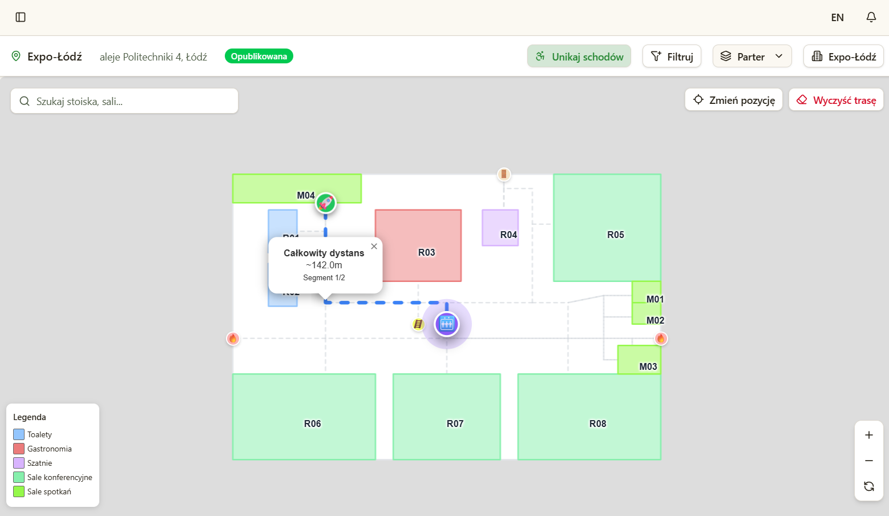
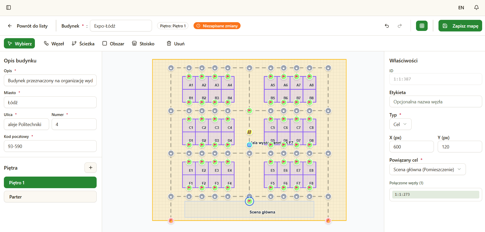
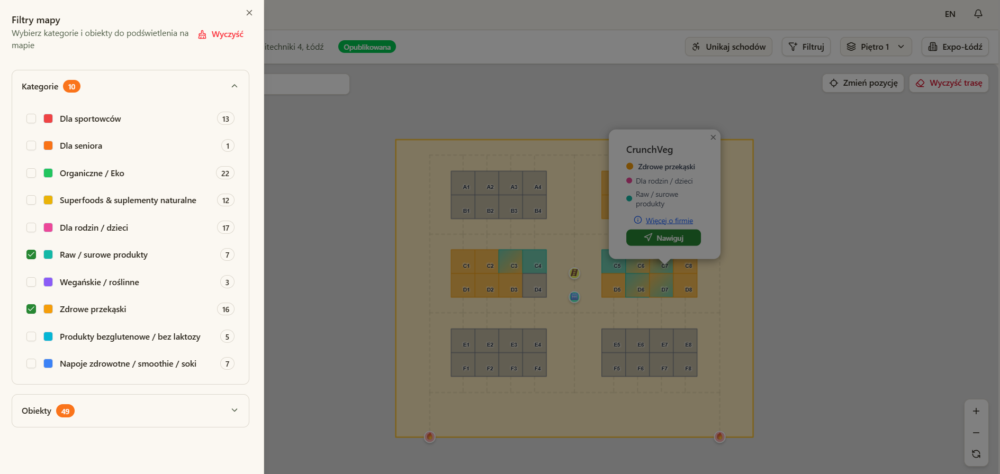

# FFoodGuide

## 📋 Opis Projektu

FFoodGuide to system stworzony z myślą o **organizacji targów branżowych**. Dostarcza narzędzia do tworzenia interaktywnych map hal i budynków, planowania rozmieszczenia stoisk, nawigacji wewnątrz obiektów oraz zarządzania wydarzeniami i spotkaniami biznesowymi. System zrealizowano w architekturze trójwarstwowej: warstwa danych (**PostgreSQL**), warstwa serwerowa (**Java + Spring Boot**) oraz aplikacja kliencka typu SPA zbudowana w **React**. Poszczególne elementy współpracują ze sobą, by zapewnić organizatorom i uczestnikom sprawne i wygodne doświadczenie podczas wydarzeń.

## 🏗️ Moduły Projektu

### 1. 📍 Moduł Planowania Przestrzeni i Nawigacji
- Wspomaganie planowania przestrzeni fizycznej
- Nawigacja uczestników na terenie wydarzenia
- **Autor:** Wiktoria Bilecka

### 2. 📅 Moduł Organizacji Wydarzeń i Spotkań Biznesowych
- Zarządzanie wydarzeniami i spotkaniami
- Organizacja aspektów biznesowych
- **Autor:** Grzegorz Janasek

---

## 🔧 Moduł: Planowanie przestrzeni i nawigacja — krótko i na temat

Moduł ten dostarcza narzędzia zarówno dla organizatorów (projektowanie, generowanie i przypisywanie stoisk), jak i dla uczestników (interaktywne mapy i wygodna nawigacja).

### 🗺️ Interaktywna mapa
- Organizator tworzy mapy wnętrz (wiele budynków i pięter możliwe).
- Użytkownik widzi pojedyncze piętro na raz — przełączanie między piętrami i budynkami intuicyjne.
- Klikalne obiekty (stoiska, sale) pokazują szczegóły: numer, opis, wystawcę itp.
- Filtry (np. kategorie tematyczne) ułatwiają wyszukiwanie interesujących miejsc.

### 🧭 Nawigacja wewnętrzna
- Użytkownik określa punkt startu i cel (może też wyszukać cel — system ustawi go automatycznie).
- Trasa jest segmentowana (wielopiętrowe/budynkowe przejścia tworzą oddzielne segmenty).
- Trasa animowana; punkty przejścia są interaktywne — kliknij, żeby przejść do następnego etapu trasy.
- Tryb „unikać schodów” (dla osób z ograniczoną mobilnością): preferowane windy i rampy ♿️.
- Wyznaczanie trasy realizowane jest autorskim algorytmem najkrótszej ścieżki w ważonym grafie z heterogenicznymi kosztami — realne trasy uwzględniają typ przejść i preferencje użytkownika.

<video width="400" autoplay loop muted playsinline>
  <source src="./assets/short.mp4" type="video/mp4">
  Twoja przeglądarka nie obsługuje wideo.
</video>

### 🖌️ Edytor map (dla organizatora)
- Interaktywny edytor 2D (rzut z góry): dodawanie budynków, pięter, sal i stoisk — rysowane bezpośrednio na mapie.
- Tworzenie węzłów i połączeń, które składają się na graf przejść wykorzystywany w nawigacji.
- Automatyczne generowanie układu stoisk: podaje się liczbę stoisk, ich wymiary i parametry korytarzy — system zaproponuje układ.
- Generowanie działa w dwóch krokach:
  1. Optymalizacja układu rzędów i korytarzy (minimalizacja niewykorzystanych miejsc, symetryczne konfiguracje).
  2. Obliczenie współrzędnych stoisk i węzłów nawigacyjnych dla wybranego układu.
- Generowanie objęte jest autorskim algorytmem optymalizacyjnym, zaprojektowanym do szybkiego uzyskiwania praktycznych układów hal, z myślą o minimalizacji ręcznej pracy organizatora i zaoszczędzenie czasu.

### 📝 Rezerwacja i przypisywanie stoisk
- Wystawcy zgłaszają zapotrzebowanie, organizator zatwierdza rezerwacje.
- System wspiera automatyczne przypisywanie wystawców do stoisk na podstawie preferencji kategorii.
- Algorytm:
  - Mierzy podobieństwo wystawców wg zadeklarowanych kategorii (kategoria główna ma większe znaczenie).
  - Generuje wstępną kolejność (kNN), ulepsza ją metodą 2-opt i powtarza z restartami, aby znaleźć dobre rozwiązanie.
  - Finalne rozmieszczenie realizowane jest w schemacie „snake pattern” i przypisywane sekwencyjnie.
- Dzięki temu wystawcy o podobnych profilach są grupowani razem tworząc kategorie — lepsze doświadczenie dla odwiedzających i wystawców.

  

  ## 🧱 Technologie i architektura
- Baza danych: PostgreSQL 🗄️  
- Backend: Java + Spring Boot (API, logika algorytmiczna) ⚙️  
- Frontend: SPA w React — interaktywne UI i edytor map 🖥️  
- Moduły algorytmiczne (generowanie stoisk, przypisania, trasy) działają po stronie serwera i wystawiają API dla klienta.

